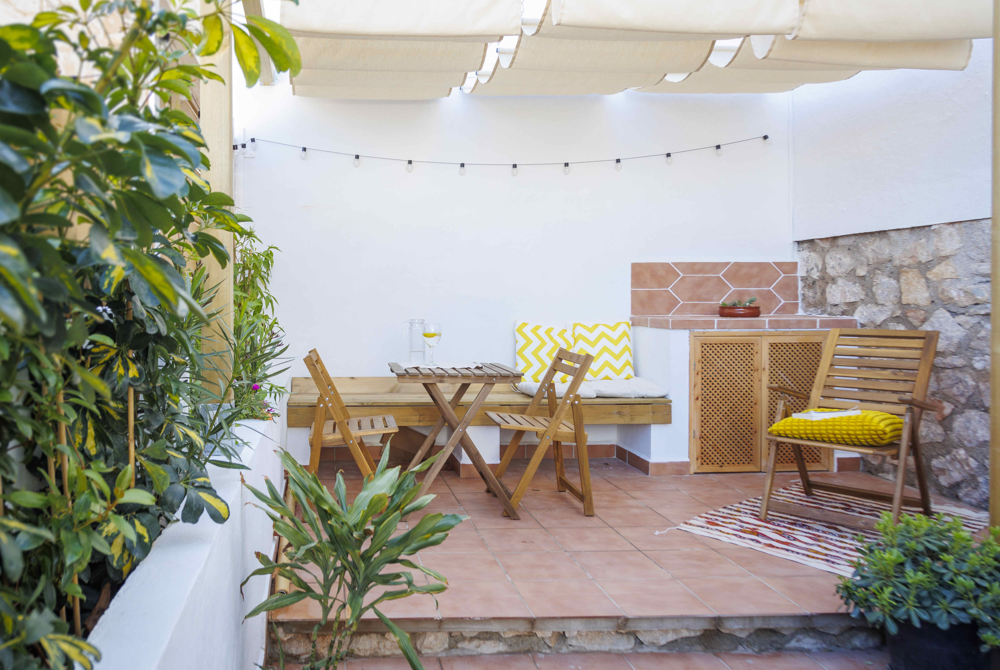

## Introducción

¡Bienvenido a Casa Salitre!
Esta guía pretende hacer su estancia lo más agradable posible, dándote información general sobre la ubicación, comodidades y electrodomésticos, así cómo sobre el acceso a la propieda. Asimismo, he incluido sugerencias de ocio en Salobreña y alrededores.

## Acceso en coche
 
Casa Salitre se encuentra en el casco antiguo de Salobreña. A continuación le indicamos cómo acceder y aparcar de la forma más cómoda posible.

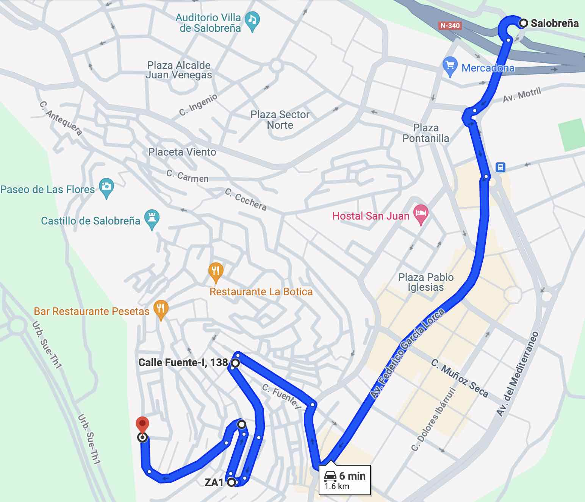

Puedes encontrar la versión más larga más abajo, pero si tienes prisa aquí tienes un [enlace a Google Maps](https://www.google.com/maps/dir/''/36.7421149,-3.5876757/36.7405093,-3.5876583/36.7412835,-3.5875691/36.7410881,-3.5891981/@36.7429609,-3.5909107,16z/data=!4m12!4m11!1m5!1m1!1s0xd718fe1b1492be7:0x381a280809a7ddfa!2m2!1d-3.5828317!2d36.7466969!1m0!1m0!1m0!1m0!3e0?entry=ttu
), que te llevará desde la rotonda que hay justo a la entrada del pueblo hasta la Estación de Radio, que es un espacio cómodo para aparcar y llegar a Casa Salitre.

Aun así, te recomiendo que eches un vistazo a las instrucciones que encontrarás a continuación, para familiarizarte con el entorno.

### Resumen de la subida

* Desde la rotonda a la entrada de Salobreña continúa recto por Avd. Federico García Lorca hasta la rotonda que conecta con Carretera de la Playa. 

* Sigue recto hasta el cruce frente al Hostal Mary-Tere. 

* Desde allí, comienza a subir por la Calle del Rosario. Continúe subiendo, siguiendo siempre las indicaciones de "A.T. Faldas del Castillo" (fíjate en las fotos en el [siguiente apartado](#la-subida-en-detalle)).

* Habrá 3 curvas antes de llegar arriba. Cuando llegues arriba, dejarás el edificio de la Radio Salobreña a la derecha (un edificio redondeado que se parece un poco a un ovni).

* Los mejores aparcamiento están en la [**plaza**](https://maps.app.goo.gl/LxMzarLG8m5dRCmr7) frente a la Estación de Radio y el [**aparcamiento**](https://maps.app.goo.gl/QvVqL4jLP5GMqn3n7) junto a ella.

### La subida en detalle

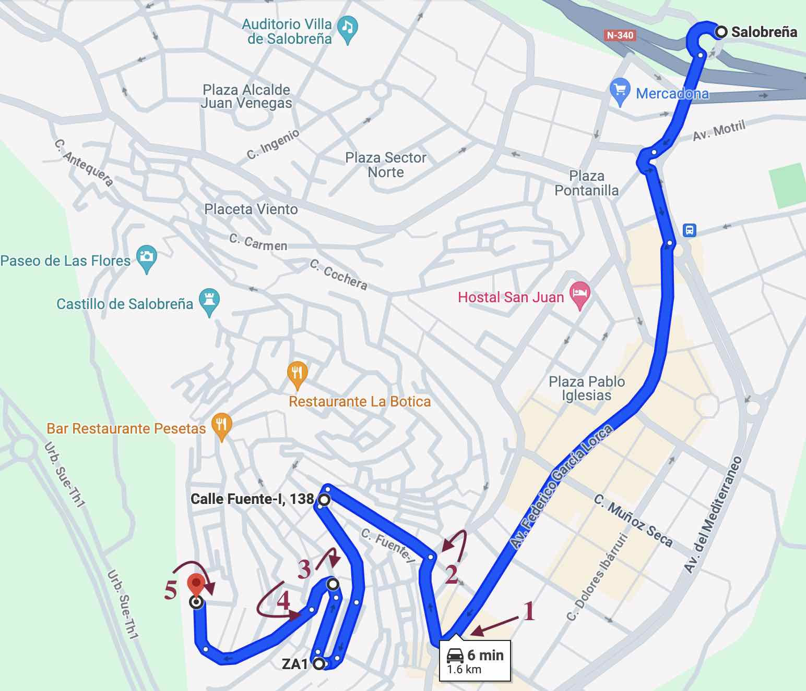

1. Al llegar a la rotonda, gira a la derecha (fíjate en el cartel: "A.T. Faldas del Castillo")

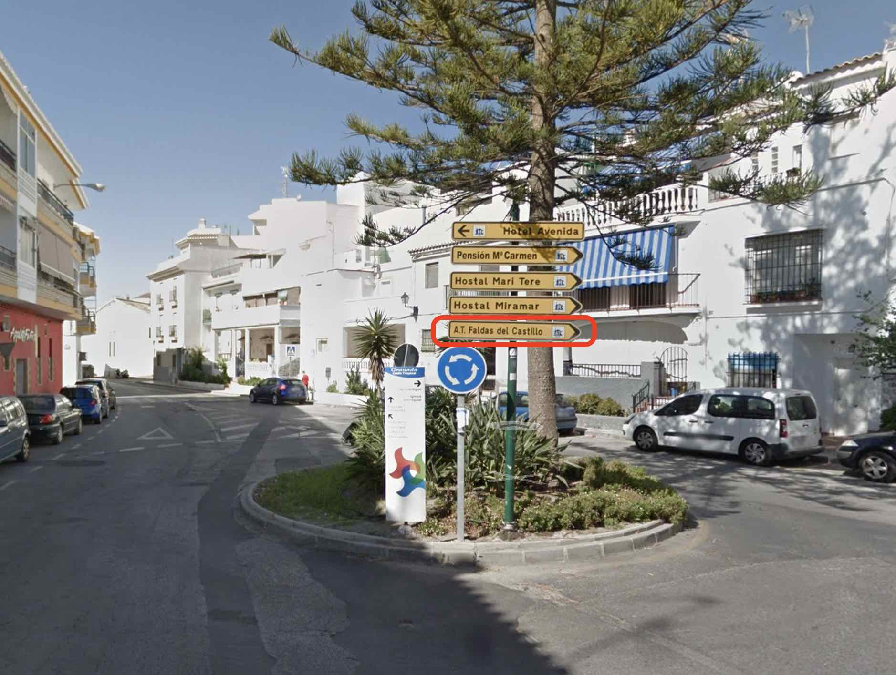

2. Desde el cruce que hay en frente del Hostal Mary-Tere (a su derecha), toma la calle que sube a mano izquierda (Calle del Rosario). 

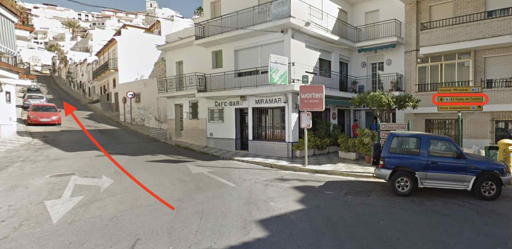

3. Cuando llegues al punto 3, verás una parada de autobús a tu izquierda (no está en la foto). Pasada la estación, gira todo a la izquierda (siguiendo el cartel "A.T. Faldas del Castillo").

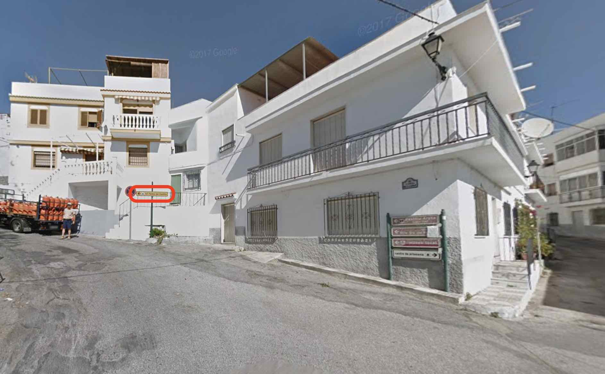
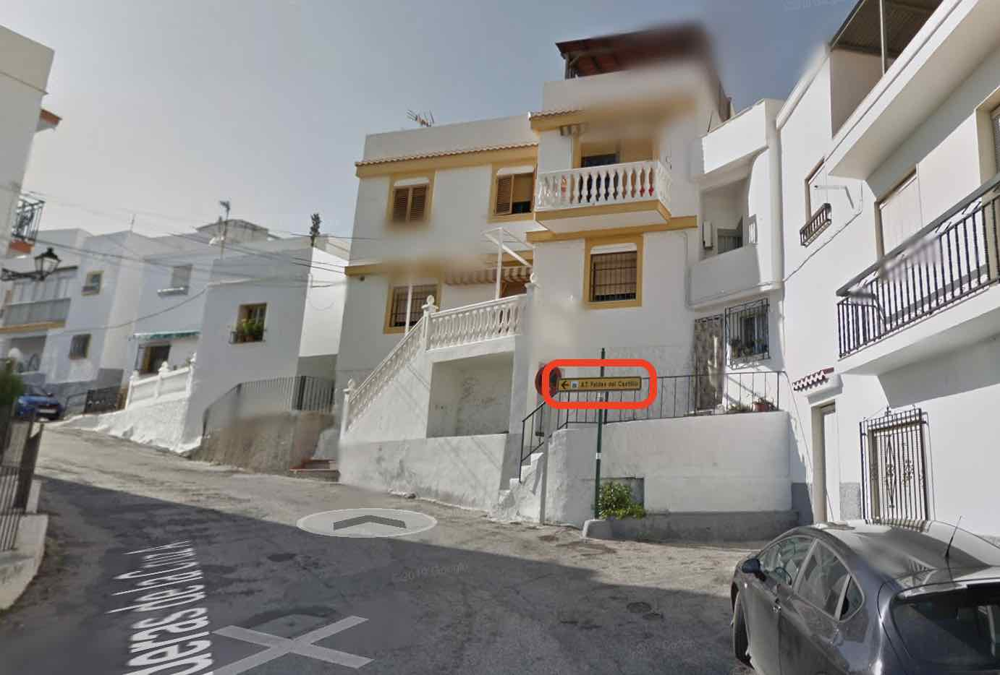

4. Sigue ascendiendo manteniéndote a la derecha en el siguiente cruce

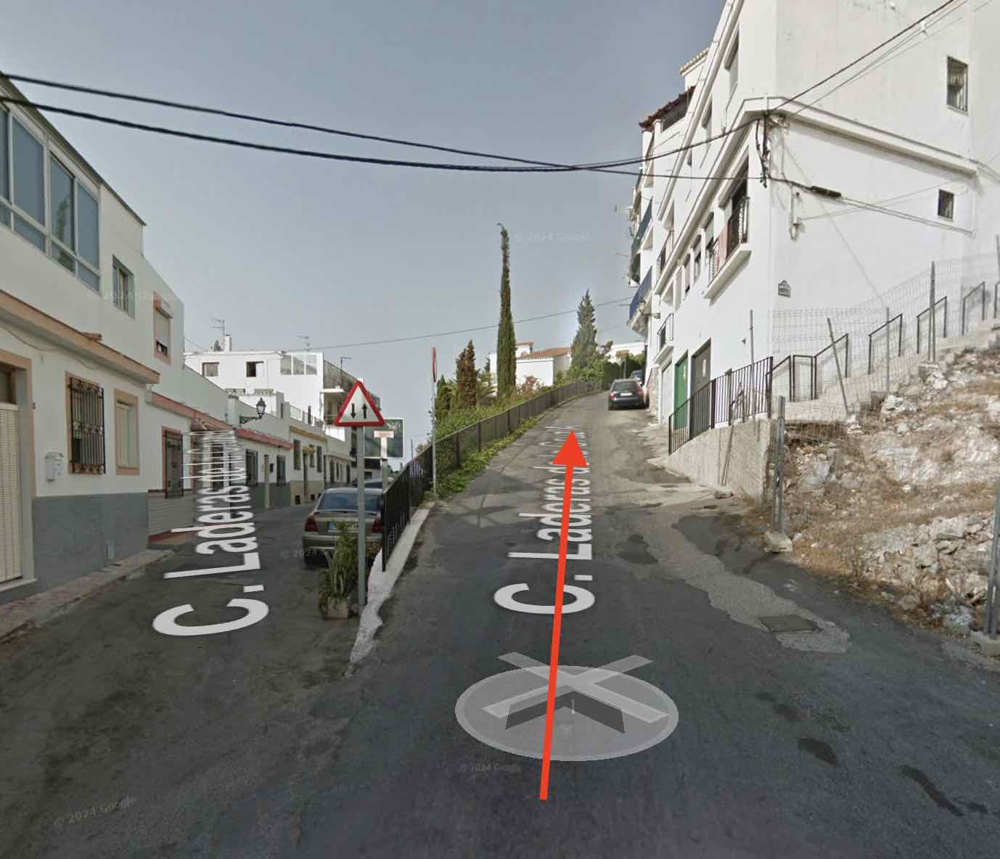

5. Llega a la estación de radio

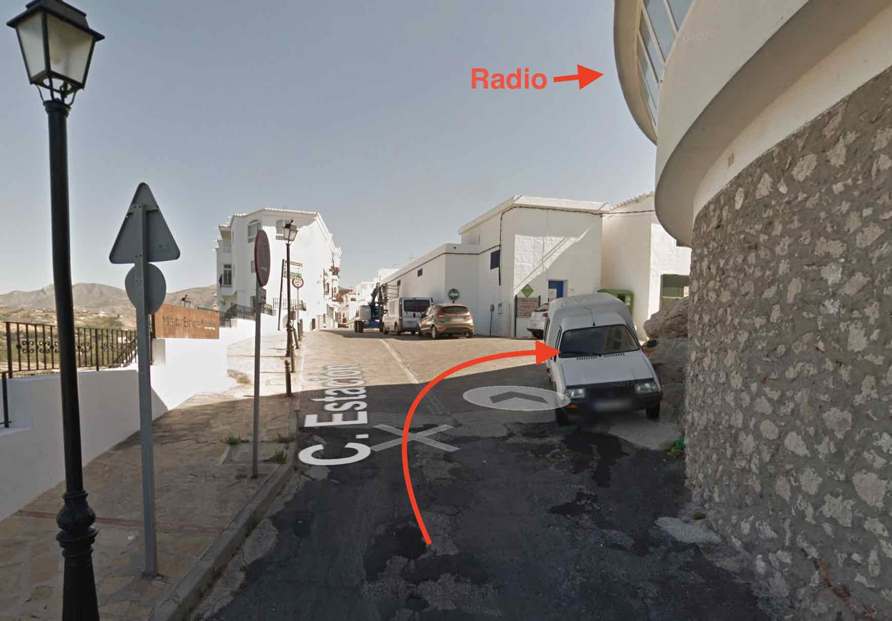
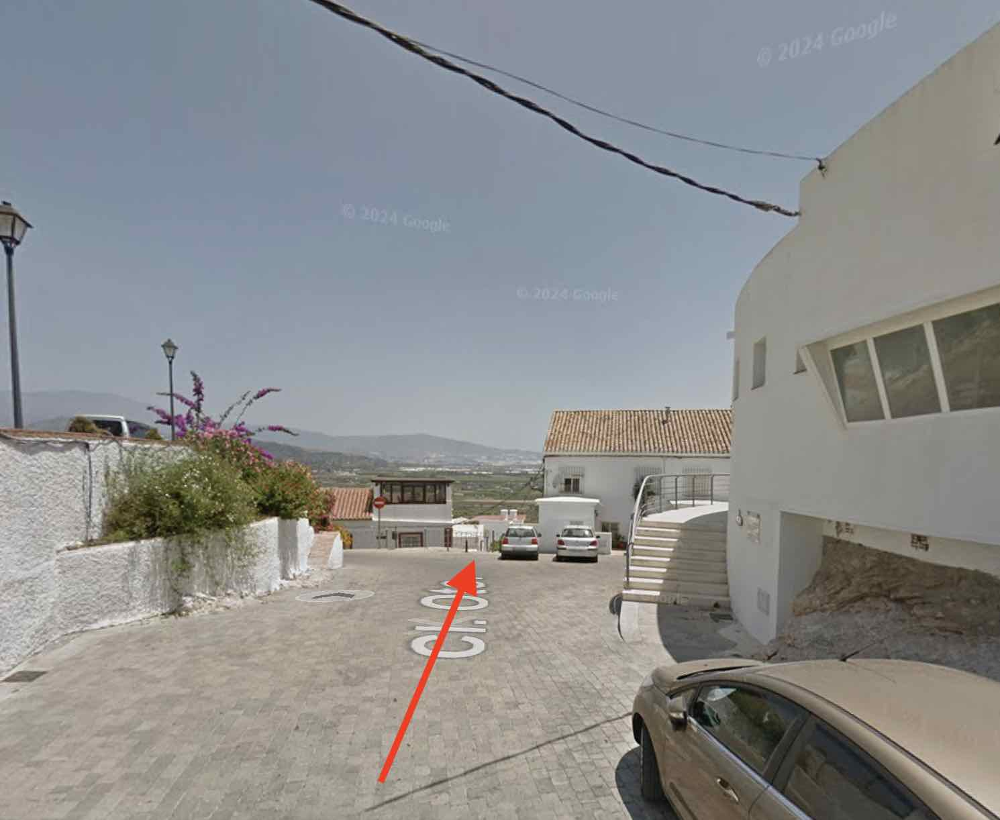

### Salir en coche

Salir es más fácil que entrar, ya que sólo hay un camino. Desde la radio sigue en la dirección por la que has venido y sigue las señales.

## Llegar a la casa

La casa está en la parte oriental del casco antiguo. La entrada está en la calle Oriente, que baja en escalera desde la radio hasta la calle Ladera de la Cruz.

### Acceso a la casa
El acceso es por la calle Oriente, que conecta la plaza de Radio Salobreña con la calle Ladera de la Cruz. Si vienes en coche, lo más probable es que hayas aparcado cerca de Radio Salobreña. Aunque hayas aparcacado en otro lugar, es un lugar muy agradable y desde allí podrás disfrutar de las vistas sobre el mar Mediterráneo desde el Mirador Enrique Morente.

Mirando a la puerta de Radio Salobreña, fíjate a tu izquierda en las escaleras que bajan (Calle Oriente), como indica la flecha roja. Después de bajar unos minutos, la Casa Salitre estará a tu derecha.

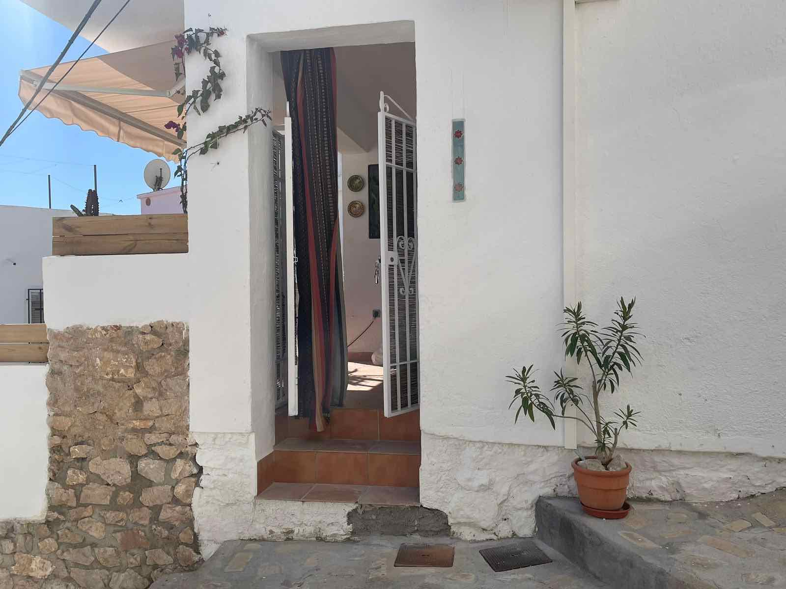

### Check-in

El check-in se realiza a través de una cajita con código que encontrarás a la derecha al mirar a la puerta. Me aseguraré de enviarte el código el día de tu llegada.

## La Casa

Aquí tienes un resumen de lo que deberías encontrar en la casa a tu llegada.

### Baño

He dispuesto unos dispensadores con jabón de manos, champú, gel de ducha y acondicionador. Cuando te sirvas tened, por favor, cuidado de retirar primero el recipiente de la cesta para que no se caiga la cesta al suelo.

Debajo del lavabo del baño habrá dos juegos de toallas y papel de water, por si fuera necesario.

### Salón y cocina

Disfruta de la televisión y del aire acondicionado. Los mandosse encuentran en el primer cajón de la mesa blanca debajo del televisor.

Os pido por favor que seais responsables con el uso del aire acondicionado. Tened siempre las puertas y ventanas cerradas cuando el aire esté encendido y apagarlo por la noche. Gracias a su orientación y aislamiento, el apartamento se mantiene fresco por la noche, incluso en los días más calurosos del verano.

Para cocinar mejor, encended la luz LED que hay en la encimera de la cocina. Mirando hacia la cocina, Eel interruptor está a la izquierda de la encimera, en el costado del mueble.

### Jardín

Hay toldos tanto en la terraza de entrada como en el jardín de abajo. Aseguraos de quitarlos por la noche, y sobretodo si hace viento.
El toldo de abajo se puede desplazar con el palo de madera disponible. Tened cuidado de no dañar la tela.
El jardín tiene un sistema de riego automático que está programado para funcionar por la tarde/noche. No os asusteis si ois un silbido, es sólo agua saliendo de las válvulas.

### Basura

Tienes varios puntos cerca de casa para echar la basura:

- [Luis Vinuesa A (esquina Ladera de la Cruz)](https://maps.app.goo.gl/w3PMLXg8KtCkSZCU7): Resto
- [Ladera de la cruz (bajando por Oriente)](https://maps.app.goo.gl/SQ8yQHJLBtFABjnT9): Resto, Envases, Cartón
- [Plaza de la radio](https://maps.app.goo.gl/3Vdpu4ZyfCiJrVeU7): Resto, Envases, Cartón, Vidrio

## WIFI

El nombre wifi es `houdini` y la contraseña es `escapingcat!`.

## Ocio

Si estás buscando algo que hacer o dónde comer mientras estás en Salobreña, he recopilado una lista de mis favoritos.Espero que la disfrutes.

### De paseo
Todo en el casco antiguo está a poca distancia. Te invito a pasear y perderte por sus encantadoras callejuelas. Es bastante seguro caminar por todas partes.

#### Castillo Árabe
Salobreña tiene un [castillo](https://turismosalobrena.com/en/the-arab-castle/) que proviene de la época árabe. Se accede por la [calle Andrés Segovia](https://maps.app.goo.gl/ZVwRxnXGWZmtKePm9). Se puede visitar, y merece bastante bastante la pena (la entrada debe rondar los 4E y los lunes por la tarde es gratis). Hay algunas excavaciones arqueológicas menores, y desde dentro podeis disfrutar del único mirador en 360º sobre Salobreña.

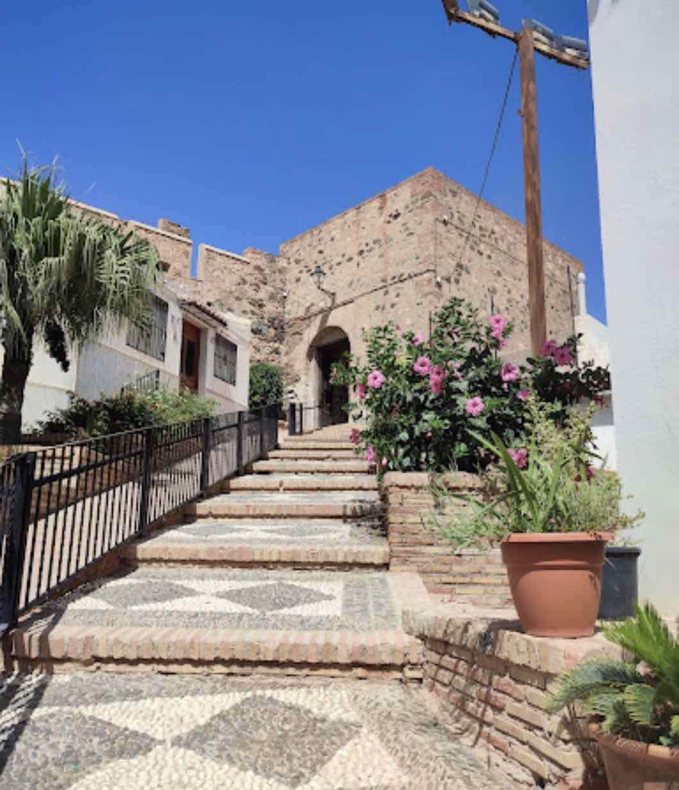

Mientras subes al castillo, verás **el taller de Enno** a la izquierda. Nacido en Alemania, Enno lleva décadas viviendo y retratando la belleza de Salobreña. Te recomendamos que eches un vistazo a sus obras.

#### Miradores
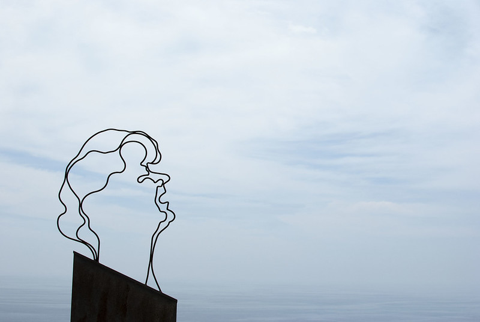
Hay numerosos **miradores** sobre el mar al sur, la vega al este así como la imponente Sierra Nevada al norte. Junto a la casa se encuentra el [**Mirador de Enrique Morente**](https://maps.app.goo.gl/y9VAA2PV24DXrZCZ7) dedicado a la memoria de uno de los cantaores flamencos más prolíficos y más conocidos internacionalmente ([consúltalo en Wikipedia](https://en.wikipedia.org/wiki/Enrique_Morente)).
Siguiendo por la calle Estación en dirección a la Iglesia y la plaza mayor, pasarás por el mirador [**Hoyo de la franscunda**](https://maps.app.goo.gl/kQZX2FFs9ohUmfF9A), desde el que podrás observar el acantilado bajo el castillo y la fauna avícola que lo habita.
Desde la [plaza mayor del casco antiguo](https://maps.app.goo.gl/ftirYyDpp57BsfmaA), justo debajo de los arcos del antiguo ayuntamiento, podreis disfrutar de las vistas sobre las partes más antiguas del casco antiguo de Salobreña.

#### La Caleta
[**La Caleta**](https://maps.app.goo.gl/hmB4T1uWi7poMUus5) es un pueblo cercano con una historia intrigante. Hasta los años 60 y durante varios siglos, la principal actividad económica de Salobreña fue la caña de azúcar. Para producir azúcar a partir de ella, en el siglo XIX se construyó una fábrica en lo que hoy es La Caleta. Pronto, la fábrica atrajo a muchos trabajadores que empezaron a construir sus casas en las cercanías y poco a poco el pueblo se fue consolidando.
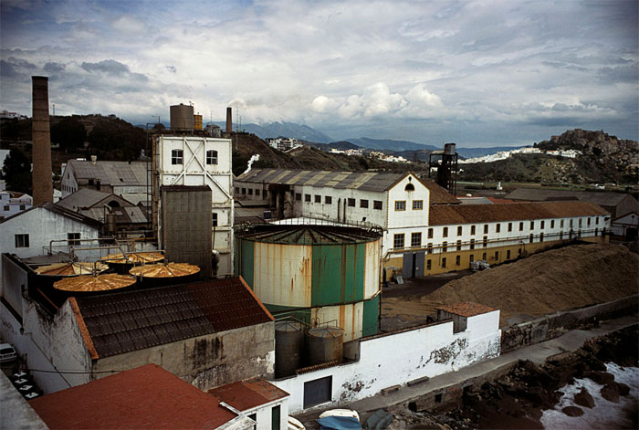

La fábrica sigue muy presente, y el pueblo merece totalmente la pena visitarlo. Recientemente ha habido una exposición de fotografía al aire libre [**Caleteros**](https://www.instagram.com/caleteros/) de artistas locales, que se puede visitar simplemente paseando por las calles. Si os ha gustado, podeis comprar el catálogo en el [**Estanco de la Caleta**](https://g.co/kgs/M1iazS5).

### Playas

Si quereis daros un chapuzón en el mar, podeis hacerlo en todo el litoral de Salobreña. El agua se refresca frecuentemente con las corrientes del Atlántico y, por lo tanto, es un poco más fría que en las partes más orientales del Mediterráneo. El agua alcanza su temperatura más agradable alrededor de julio y se mantiene templada prácticamente hasta Noviembre.

Si os apetecen playas más recogidas, podeis probar con la [playa **Playa de la cagailla** o **Pnta del río**](https://maps.app.goo.gl/3FAw7PDUxAesyfDa6) al este (podeis dar un paseo por la playa o llegar en coche fácilmente), o para los más aventureros podéis probar a explorar la parte más occidental de la bahía de Salobreña, saliendo desde la Caleta y caminando sobre las piedras hacia [**el Caletón**](https://maps.app.goo.gl/NAvosygrmqyk8L927) y más allá. 

Si vais en coche, os recomiendo visitar las impresionantes playas del Parque Natural que queda al oeste de Almuñécar (a unos 15-20 minutos en coche). Estas playas están un poco menos concurridas, sobre todo debido a la dificultad para llegar, ya que no hay muchas oportunidades de aparcamiento. En cualquier caso, las he enlazado con puntos en google maps donde suele ser fácil encontrar aparcamiento. La primera es [**Cantarriján**](https://maps.app.goo.gl/3FAw7PDUxAesyfDa6) (una playa nudista con opciones para comer), a la que sólo se puede acceder en temporada alta en autobús (billetes de unos 2E). 

A continuación, [**el Cañuelo**](https://maps.app.goo.gl/Hk4UfD7zGJA1W3SP6). Hay que bajar un poco por un camino de tierra hasta llegar a su larga y amplia orilla. Hay opciones para comer.

Más al oeste, encontrará [**Cala Pino**](https://maps.app.goo.gl/V2HEsHKAvhtRTi8K7). El aparcamiento está junto a la carretera. Desde allí, hay que seguir por un sendero empinado. Esta playa puede seguirse hacia el oeste sobre las rocas, lo que permite llegar a **Playa Lapa**.

Por último, más al oeste se encuentra la [**Playa del Molino**](https://maps.app.goo.gl/jEEx7NjYqvLfLZWbA). Esta playa cuenta con una pequeña piscina llena de agua natural que proviene de un manantial.

### Comida
Hay mucho que descubrir en la gastronomía local de Salobreña. He enumerado mis lugares favoritos, tanto dentro como cerca de Salobreña.Espero que podais encontrar algo de vuestro gusto.

#### A poca distancia
A pesar de su pequeño tamaño, Salobreña cuenta con varios restaurantes notables. Mi favorito es [**la Roka**](https://maps.app.goo.gl/1cS7G4CdWEGT41Wq5), en la calle Estación, un restaurante galardonado con una mezcla de cocina tradicional y moderna y mucha fusión.También tiene unas vistas impresionantes de la puesta de sol sobre el mar y una buena selección de cócteles. A menudo está reservado con semanas de antelación, pero merece la pena intentar conseguir un sitio.

Más tradicionales son [**el Pesetas**](https://maps.app.goo.gl/Dz7XN6tNvN8LCa978) y [**la Botica**](https://maps.app.goo.gl/GFz6VxFG5g3oYByb7), donde se pueden degustar platos tradicionales y locales así como platos de pescado frito, mientras disfruitais de sus terrazas con vistas sobre la ciudad y los alrededores.

Para una velada agradable con comida y espectáculo de flamenco, puede consultar [**la Traviesa**](https://maps.app.goo.gl/DHwBHqBPK1hQPRuu5). Normalmente tienen eventos los lunes por la noche (aunque esto puede cambiar, aseguraros de llamar, preguntar y reservar si estais interesados).

#### En la playa
Hay muchos chiringuitos a lo largo del paseo marítimo de entre los que elegir. Suelen tener una larga carta de pescados que normalmente se pueden pedir a la plancha o fritos. Para un menú más delicado y elegante, podeis probar con [**el Verdejo**](https://maps.app.goo.gl/hUTMkErPoj2dAtF49). Si os apetece una cena más internacional con pizzas y hamburguesas, podeis probar [**La Bahía**](https://maps.app.goo.gl/vhUcopZkME3dp2r98).
Si estais planeando visitar [la Caleta](#la-caleta), deberías probar las parrillas del [**Turrito**](https://maps.app.goo.gl/jtV7DoeMQKPvzShg7), sobretodo si os apetece un buen corte de carne, o [**el Puentecillo**](https://maps.app.goo.gl/BvUXRoxoQ7k58jHcA). Un favorito mío para comer pescado a la orilla del mar son tanto el [**Manolo**](https://maps.app.goo.gl/dmzNUSL322SFv9aPA) como el [**Rufino**](https://maps.app.goo.gl/UE9P7s81vG1twagL9) de La Guardia (este último con opciones más estilo fusión y modernas).

#### En torno a Salobreña

Justo saliendo de Salobreña, hay un restaurante de lujo muy agradable en la planta baja del Hotel [**MIBA**](https://maps.app.goo.gl/dUUqsdHUEXSAaq6Y6). Si te gusta la tarta de queso, deberías ir a probar la suya. Personalmente, no he probado una tarta de queso mejor. Además, seguro que os sorprende el nivel de su cocina, degustando vuestra cena mientras disfrutais de las vistas de la costa. También tienen una terraza en la azotea para disfrutar de cócteles y otras bebidas.

Por último, si vas a visitar las playas que hay al oeste de Almuñécar, te recomiendo que intentes conseguir una reserva para cenar en 
[**Cerro Gordo**](https://maps.app.goo.gl/SaT2tBxmmimu3aAT9), quizás la mejor vista del atardecer mientras cenas en la región.

